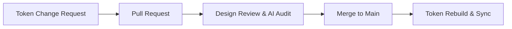
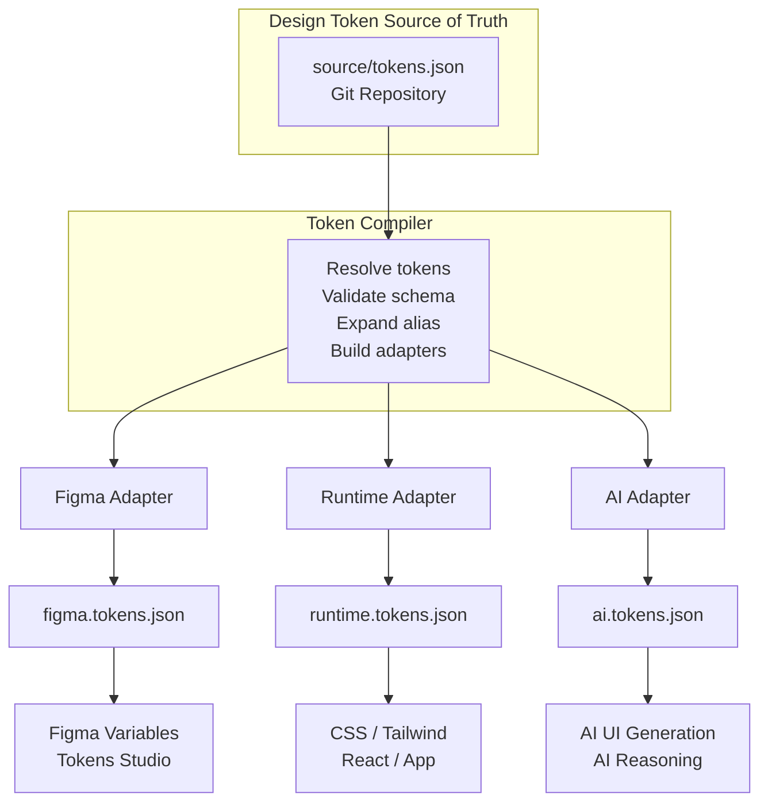
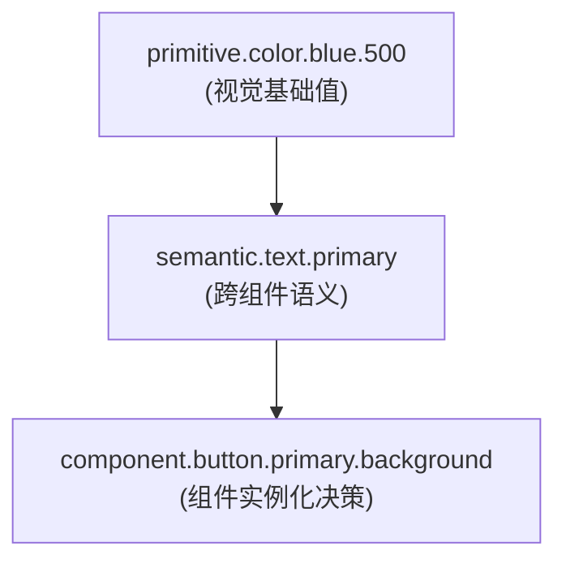

# AI-Native Design System 周汇总报告
**日期：2026年3月9日**

---

## 一、Design System 重构 & Skill 的目的与原则

### 1.1 重构目标

- **全面 AI-Native 化**：推动设计系统从底层架构到应用逻辑深度适配 AI 驱动的工作流。面向用户：设计师，开发，AI。
- **规范语义与结构**：建立严谨的 Token 命名规范与层级结构，提升机器对设计意图的理解精度。
- **定义自动化 Skills**：基于 Agent 工作流，构建涵盖 Audit、Optimize、Refactor、Sync 等核心能力的 AI Skill 体系，实现设计资产的自动化审计、优化与同步。

### 1.2 四大核心原则

- **SSOT 与单向同步**：坚持 Git 作为设计资产的单源真理（SSOT）。严禁直接编辑 Figma Token JSON，通过单向流转机制（Git -> Figma/Code）规避逻辑冲突。
- **语义化分层治理**：建立严谨的 `Primitive -> Semantic -> Alias` 命名体系。通过结构化语义提升 AI 对设计意图的理解精度。
- **自动化适配优先**：构建转换层实现多端适配，通过插件化适配器降低 AI Skill 接入成本。
- **效率优先与工具协同**：在优化的同时，最大化匹配各个角色使用工具的效率，而不是硬性规范。

---

## 二、进度与 Roadmap

> 采用双轴并行开发模式，目前正处于 **AI-Native 语义化治理** 与 **Skill 测试迭代** 的关键同步节点。

### 2.1 轴 1：AI-Native DS重构
- ✅ **1. Token 命名结构治理** (已完成)
- ⚡ **2. AI NATIVE 语义治理** (进行中)
- ⏳ **3. 修改或扩充当前 Token 值** (待启动)
- ⏳ **4. 应用到 Source JSON & Figma** (待启动)

### 2.2 轴 2：可复用 Skills 开发
- ✅ **1. Audit 和优化 Skill** (已完成)
- ✅ **2. Refactor 和 Code Sync Skill** (已完成) *(注: 此节点至下一节点之间存在较高的难度进度要求)*
- ✅ **3. 合并成一个 Skill 和对应脚本/模板修改** (已完成)
- ⚡ **4. 测试和迭代** (进行中)
- ⏳ **5. 内部测试** (待启动)

---

## 三、体系化治理 (Design Governance Flow)

作为单源真理(SSOT)的保障，所有的 Token 修改或新增都必须遵循严格的治理流程，从源头确保正确性。

核心保障：
* **设计治理**：所有的变动都能被评审，避免被误改。
* **版本可追溯**：依托 Git 构建了完美的版本变更历史，随时可以回滚或查阅。
* **自动化审计**：结合我们开发的 AI Audit Skill，可以在 PR 阶段直接拦截不符合四层语义规范的错误代码。

---

## 四、AI-Native DS 核心架构与流程

### 4.1 SSOT 与单向流转架构示意

#### 4.1.2 挑战和原因
- **Figma MCP 与 API 限制**：目前 Figma MCP 存在局限性，`get variable` 无法获取全局 Variable Token 定义，仅能获取页面内 Node 应用的变量。在 Token 写入自动化方面，Figma REST API 存在根本上的分层限制：
  - > *补充信息 1（Variables）：Figma 官方文档说明通过 REST API 直接写入变量（`file_variables:write`）是 **Enterprise（企业版）** 的专属特权。普通免费版或 Pro 版均无权限。*
  - > *补充信息 2（Styles）：对于渐变色 (Gradient)、阴影等必须映射为 Figma Styles 的 Token，**Figma REST API 对所有版本（包括 Enterprise）均未开放写入权限**，必须依赖 Plugin API 在客户端环境执行操作。*
  - > **核心决策定论**：即使升级至 Enterprise Plan，依然无法实现全自动化、无人工干预的服务端 Token 写入闭环（渐变等必需属性仍需插件辅助）。因此，目前的 **Org/Pro Plan + 自动化 Plugin API 脚本** 架构，是成本与体验双赢、并且唯一能打通所有 Token 产出物（Variables + Styles）的最高效可行方案。
  - 同时，MCP的变量读取能力，意味着，普通的audit （MCP+AGENT BROWSER）不能精准的读取所有的token，导致audit报告失真。
- **Token Schema 差异与兼容性**：Figma 原生 Schema 较为保守（如不支持 Gradient 等复杂属性），而 TokenStudio 等插件的完整 Schema 虽然强大但需要 Pro 计划。这些格式与四层语义结构及审计规范存在一定差异，因此决定采用 SSOT 结构，并在应用层进行转换（Adapter Layer）。

### 4.2 语义化分层体系

基于上述架构，我们建立了一套供 AI 消费的四层 Token 语义体系，实现从“抽象数值”到“业务意图”的转换。

1. **Primitive Layer (基础层)**：定义最基础的原子值（颜色、间距、圆角等 scale），不包含业务语义，是系统的视觉比例尺。
2. **Semantic Layer (语义层)**：核心 AI 理解层，遵循 **category.role.state** 命名。将基础值映射到设计意图，支持跨场景推理。
3. **Pattern Layer (模式层)**：抽象通用的 UI 模式（如 Surface、Layout），定义更高维度的交互样式规则。
4. **Component Layer (组件层)**：组件级的实例化决策。组合语义与模式，用于 Runtime 与 AI 系统重建具体组件。

**为什么这是真正的 AI Native？**

| 对比维度 | Before: 非 AI Native (来自 `original token json`) | After: AI Native (来自重构后的 `source/tokens.json`) |
|---|---|---|
| **命名结构 (Naming)** | 依赖个人习惯的扁平命名。如 `"Text": { "Link or button": ... }`，层级随意，机器无法建立全局逻辑树。 | 严格的语义化分层。如 `semantic.text.action`，AI 可根据路径结构直接推理出它属于文本类、动作交互状态。 |
| **视觉取值 (Value)** | 硬编码 (Hardcoded) 的绝对色值。例如：`"hex": "#007FFF"`。AI 在生成代码时容易直接写死色号，产生无数不受控的“魔法数字”。 | 引用关联 (Alias Reference)。例如：`"$value": "{primitive.color.blue.500}"`。AI 分配颜色时只能指向严格定义的 Primitive Scale，杜绝了视觉偏差。 |
| **推理依据 (Reasoning)** | 缺乏给 AI 的上下文指令，仅是存储色值的容器。 | 强制包含专属的 `$description` 供 AI 读取（如：*"Interactive action text... brand blue to signal links, CTAs"*），作为大模型选择该属性的绝对依据。 |

### 4.3 AI Token 消费流与一致性约束

- **AI 生图链路 (Generation Flow)**：`User Prompt` -> `AI Reasoning (意图与语义解析)` -> `Component Resolution (解析组件层)` -> `Token Lookup (检索 Semantic/Pattern)` -> `Generate UI (按需调用代码或设计模型)`。
- **AI 重组组件 (Resolution)**：AI 通过 Token 层级重建组件。例如读取 `component.button.primary` 时，会自动拆解并映射至对应的 Semantic 色彩、标准文本样式和 Primitive 比例尺。
- **强一致性设计约束**：AI 生成 UI 必须严格匹配设计规范，禁止创造未知视觉偏差。禁止硬编码颜色（如 `#007FFF`），禁止魔法数字（通过 Scale 指定，如使用 `spacing.8` 而不是 `7px`），并要求对预定义资产的绝对映射。

---

## 五、之后计划

（双轴）本周计划：
* skill化文件目录
* 修改现在的design token，聚焦值的修改，而非语义结构，增加component层

---

*— End of Report —*
